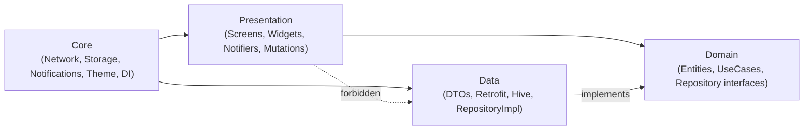
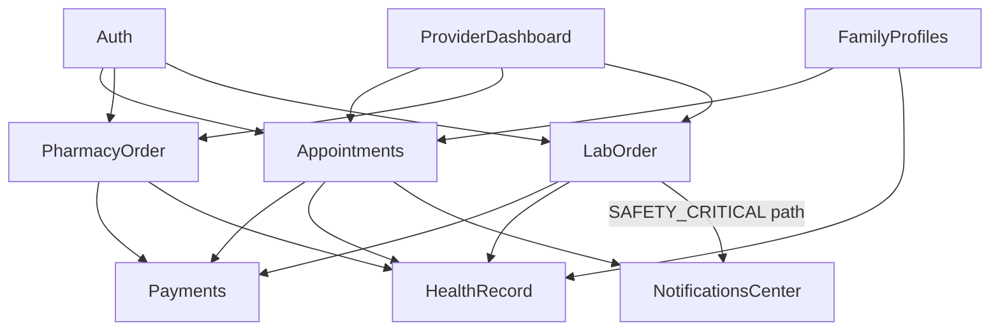

# MedSuper — Flutter Client Architecture Specification (v1.0)

**Role:** Senior Flutter Architecture Design — structure and contracts only, no application/business logic implementation (per instruction).
**Derived from:** `Healthcare-Super-Platform-Discovery-Document.md` + `MedSuper-SRS-Enterprise-Blueprint.md`
**Stack pin (verified current, Aug 2026):** Flutter stable 3.44.x / Dart 3.9.x · Riverpod **3.0** (stable) · go_router **16.x** + go_router_builder **4.x** · Freezed **3.x** (sealed classes + native Dart 3 pattern matching) · Dio · Retrofit · **hive_ce / hive_ce_flutter** (the actively-maintained continuation of Hive — the original `hive`/`hive_flutter` packages have had no meaningful updates in ~2 years; `hive_ce` is a drop-in-spirit replacement, faster, and requires Dart 3, which this project already does) · flutter_secure_storage · firebase_messaging · firebase_crashlytics · easy_localization · responsive_framework · Material 3.

---

## 0. Scope & Key Architectural Decisions

The SRS explicitly separates surfaces by role (§29 "Mobile UX Flows — Patient App", §30 "Web Dashboard UX Flows — Doctor/Clinic/Pharmacy/Lab/Super Admin"). A single unscoped "one app for everyone" design would fight that reality. This architecture makes six deliberate decisions up front:

| # | Decision | Why (traced to source doc) |
|---|---|---|
| 1 | **One codebase, two build flavors:** `patient` and `provider` (Doctor + Clinic front-desk + Pharmacy counter + Lab phlebotomist). Super Admin is **out of scope for Flutter** — SRS §30 itself describes it as "designed for a small internal ops team... information density over onboarding-friendliness" → a web dashboard, not a mobile/tablet app. | Avoids shipping unused role code in the Patient binary; matches how the product is actually consumed. |
| 2 | **Riverpod is the only DI mechanism** — no `get_it`/service-locator layered on top. | Avoids two competing dependency graphs; Riverpod 3's `Ref` + provider graph is a complete DI container on its own. |
| 3 | **Result/Failure modeling via Freezed 3 sealed classes + native Dart 3 pattern matching** (not `.when()`/`.map()`, which Freezed has deprecated in favor of `switch`). | Current idiomatic Dart 3, and it directly encodes the backend's own standard error envelope (SRS §16: `{ error: { code, message, correlation_id } }`). |
| 4 | **A single shared `payments` feature module**, consumed by Appointments, Pharmacy, and Lab — never three separate payment implementations. | Mirrors SRS §12 explicitly: *"one payment ledger and rules engine shared by booking, pharmacy, and lab — not three bolted-on payment flows."* The client should not re-introduce the silo problem the backend redesign (§0) eliminated. |
| 5 | **A client-side Notification Priority Router** replicating the backend's 4-tier model (`SAFETY_CRITICAL / TRANSACTIONAL / INFORMATIONAL / MARKETING`, SRS §13). | Critical-lab-value alerts must bypass quiet hours/mute **on the client**, not just be tagged that way server-side. |
| 6 | **Offline-first with an Outbox pattern**, built on `hive_ce`. | Directly required by SRS NFR: *"queued actions (booking, cancel) sync on reconnect with conflict resolution"* and the Redesign Notes (§0): *"Mobile apps ship with offline-first booking cache and queued actions."* |

Everything below implements these six decisions concretely.

---

## 1. Folder Structure

```
lib/
├── main_patient.dart              # entry point — flavor: patient
├── main_provider.dart              # entry point — flavor: provider
├── bootstrap.dart                  # shared startup: Hive.init, Firebase.init, locale rehydrate, runApp
│
├── app/
│   ├── app.dart                    # MaterialApp.router + ResponsiveBreakpoints wrapper + theme + locale
│   ├── flavor.dart                 # Flavor enum {patient, provider}, current-flavor accessor
│   └── router/
│       ├── app_router.dart         # GoRouter instance, composed per flavor
│       ├── route_guards.dart       # redirect / onEnter logic (auth, role, onboarding)
│       └── routes/                 # one file per feature, @TypedGoRoute definitions
│           ├── auth_routes.dart
│           ├── appointment_routes.dart
│           ├── pharmacy_routes.dart
│           ├── lab_routes.dart
│           ├── provider_dashboard_routes.dart
│           └── ...
│
├── core/
│   ├── config/                    # AppConfig (env), EnvKeys, flavor-specific base URLs
│   ├── constants/                 # api paths, hive box names, storage keys, durations (5-min hold TTL, etc.)
│   ├── network/
│   │   ├── dio_client.dart
│   │   ├── interceptors/
│   │   │   ├── correlation_id_interceptor.dart
│   │   │   ├── auth_interceptor.dart
│   │   │   ├── idempotency_key_interceptor.dart
│   │   │   ├── logging_interceptor.dart
│   │   │   ├── error_interceptor.dart
│   │   │   └── retry_interceptor.dart
│   │   └── network_info.dart      # connectivity_plus wrapper
│   ├── error/
│   │   ├── failure.dart           # @freezed sealed class Failure {...}
│   │   ├── api_exception.dart     # thrown by data layer, mapped from Dio
│   │   └── result.dart            # typedef Result<T> = Either<Failure, T>  (or bespoke sealed Result<T>)
│   ├── storage/
│   │   ├── hive_service.dart      # box registration, encryption cipher setup
│   │   ├── secure_storage_service.dart
│   │   ├── cache_policy.dart      # enum {cacheFirst, networkFirst, networkOnly, cacheOnly}
│   │   └── outbox/
│   │       ├── pending_action.dart        # @freezed model persisted to Hive
│   │       ├── outbox_box.dart
│   │       └── sync_service.dart          # replays queued actions on reconnect
│   ├── notifications/
│   │   ├── fcm_service.dart
│   │   ├── notification_priority.dart     # enum mirrors SRS §13 tiers
│   │   ├── notification_priority_router.dart
│   │   └── local_notification_service.dart
│   ├── crash/
│   │   └── crashlytics_service.dart
│   ├── theme/
│   │   ├── app_theme.dart
│   │   ├── color_schemes.dart
│   │   ├── typography.dart
│   │   └── breakpoints.dart               # responsive_framework Breakpoint config
│   ├── localization/
│   │   └── locale_keys.g.dart             # generated by easy_localization
│   ├── di/
│   │   └── core_providers.dart            # Dio, Hive boxes, SecureStorage, services — all Riverpod providers
│   ├── utils/                              # formatters, validators
│   └── widgets/                            # AppButton, AppTextField, AsyncValueView, EmptyState, ErrorBanner
│
├── features/
│   ├── auth/                       {presentation, domain, data}
│   ├── onboarding/
│   ├── search_discovery/           # doctor/pharmacy/lab search & filters
│   ├── provider_profile/           # doctor/clinic/pharmacy/lab public profile + reviews
│   ├── appointments/                # booking, reschedule, cancel — mirrors Appointment state machine
│   ├── health_record/               # unified timeline: encounters / prescriptions / lab results
│   ├── pharmacy_order/               # patient-side: send-to-pharmacy, substitution approval
│   ├── lab_order/                    # patient-side: self-request, home vs branch, results
│   ├── payments/                     # SHARED module — PaymentIntent flows, wallet (decision #4)
│   ├── reviews/
│   ├── notifications_center/
│   ├── family_profiles/              # dependent linking (Discovery §10.1 / SRS FR-13)
│   ├── provider_dashboard/            # flavor: provider only
│   │   ├── doctor_calendar/
│   │   ├── clinic_queue/
│   │   ├── pharmacy_console/
│   │   └── lab_console/
│   └── profile_settings/
│
├── l10n/
│   └── assets/translations/{en.json, ar.json}
└── firebase_options.dart
```

Each feature (`features/<name>/`) is internally split by Clean Architecture layer:

```
features/appointments/
├── domain/
│   ├── entities/            # Appointment, AppointmentStatus (pure Dart, zero Flutter/Dio/Hive imports)
│   ├── repositories/        # abstract AppointmentRepository
│   └── usecases/            # BookAppointmentUseCase, CancelAppointmentUseCase, RescheduleUseCase, ...
├── data/
│   ├── models/              # AppointmentDto (Freezed + json_serializable) + toEntity()/fromEntity()
│   ├── datasources/
│   │   ├── remote/          # AppointmentApi (Retrofit @RestApi)
│   │   └── local/           # AppointmentCacheStore (hive_ce)
│   └── repositories/        # AppointmentRepositoryImpl
└── presentation/
    ├── controllers/         # @riverpod Notifier/AsyncNotifier + Mutation declarations
    ├── screens/
    └── widgets/
```

---

## 2. Layers

| Layer | Contains | May depend on | Must NOT depend on |
|---|---|---|---|
| **Domain** | Entities, repository interfaces, use cases, business validation (e.g. cancellation-fee tier preview, per SRS §21) | Nothing but pure Dart | Flutter SDK, Dio, Hive, Riverpod |
| **Data** | DTOs, Retrofit API interfaces, Hive stores, repository implementations | Domain (implements its interfaces), `core/network`, `core/storage` | Presentation |
| **Presentation** | Screens, widgets, Riverpod controllers/Notifiers/Mutations | Domain (use cases only, via providers) | Data (never import a datasource or DTO directly) |
| **Core** | Cross-cutting technical capability (network, storage, notifications, theme, DI) | Nothing feature-specific | Any `features/*` |

**The one rule that matters most:** Presentation talks to Domain, never to Data. This is what keeps a UI screen from silently coupling itself to "the API shape" instead of "the business concept" — exactly the coupling the SRS Redesign Notes (§0) criticize in the *original* idea ("Booking, pharmacy, lab are separate silos... patients re-enter data 3x"). If Presentation is allowed to reach into Data, the same silo problem re-appears at the client layer even though the backend fixed it.

Enforcement: a `core_providers.dart`-only import boundary is easy to violate by habit, so this should be backed by an `import_lint`/`custom_lint` rule (or at minimum a documented PR-review checklist item) rejecting `import '.../data/...'` inside any `presentation/` file.

---

## 3. Dependency Graph

**Layer dependency direction (per feature):**



**Cross-feature module graph** — the part that actually reflects this specific product, not generic boilerplate:



`Payments` and `HealthRecord` are **depended upon**, never the reverse — same asymmetry the SRS gives the backend's Payment Service and Encounter/EMR Service (§28: both are shared services other services call into, not the other way around).

---

## 4. State Management Strategy — Riverpod 3

Riverpod 3 changed two things this architecture relies on directly: providers now use a single plain `Ref` (no more per-provider generated `FooRef` types), and **Mutations** are a first-class way to model a user-triggered side effect with its own loading/success/error state — a much better fit for "tap Book, tap Cancel, tap Pay" than hand-rolling an `AsyncNotifier` for every button.

**Provider taxonomy (pick deliberately, not by habit):**

| Need | Riverpod construct |
|---|---|
| Stateless dependency (Dio, a repository, a service) | `Provider` (code-gen `@riverpod` function returning the instance) |
| Read-only async data (doctor search results, doctor profile) | `@riverpod` `Future<T>` function → consumed as `AsyncValue<T>` |
| A live/derived slice that must recompute reactively | `@riverpod` plain function (auto-`Provider`), `.select()` at the call site to limit rebuilds |
| Local, mutable UI/domain state with its own lifecycle (e.g. in-progress booking draft before submission) | `@riverpod class ... extends _$X` (`Notifier`/`AsyncNotifier`) |
| A user-triggered side effect: Book, Cancel, Pay, Accept-substitution | **Mutation** — declared once, invoked from the widget, exposes its own `MutationState` (idle/pending/success/error) without polluting the entity provider's own state |
| Parameterized queries | `.family` (e.g. `doctorDetailProvider(doctorId)`, `pharmacyQuoteProvider(orderId)`) |
| Push-driven stream (FCM messages, live queue count on a provider dashboard) | `StreamProvider` |

**Mapping onto backend state machines:** Each entity with a backend state machine (Appointment, PharmacyOrder, LabOrder, PaymentIntent — SRS §9–12) gets one `AsyncNotifier<EntityState>` per active instance (`.family` keyed by id) that:
1. Loads current state from the repository (server source of truth).
2. Exposes the *local optimistic* transition (e.g., `HELD` immediately on tapping a slot) via a Mutation, before the server confirms.
3. Reconciles to server state on response — if the server disagrees (e.g., slot was taken — SRS §9 edge case), the Notifier corrects state and surfaces a `Failure.conflict`, not a generic error.

**Cross-cutting observability:** a single `ProviderObserver` override (registered once in `main_*.dart`) forwards any provider that resolves to `AsyncError` into `CrashlyticsService`, filtered by the Error Handling rules in §6 (business failures are not noise-reported; unknown/server failures are).

**Experimental note, not adopted yet:** Riverpod 3 ships an experimental *offline persistence* feature. Given `hive_ce` already satisfies the explicit local-storage requirement and the Outbox pattern needs full control over conflict resolution, this architecture does **not** adopt Riverpod's offline persistence for v1 — worth revisiting once it stabilizes.

---

## 5. Navigation Strategy — go_router

- **Typed routes via `go_router_builder`** (`@TypedGoRoute<T>` classes) — every screen argument is a constructor parameter, not a stringly-typed query param. Given the number of features (15+), this is the difference between refactor-safe navigation and a slow leak of runtime `null` crashes.
- **Route composition per flavor:** `patientRoutes` and `providerRoutes` are separate top-level route lists, combined into a single `GoRouter(routes: flavor.isPatient ? patientRoutes : providerRoutes)` at app start — unused routes are tree-shaken per binary.
- **Shell pattern:** `StatefulShellRoute.indexedStack` (the 2026-standard replacement for manual `IndexedStack` + bottom-nav wiring) for the Patient app's bottom tabs (Home / Search / Health Record / Notifications / Profile), preserving each tab's own navigation stack. The Provider flavor uses a persistent side-nav shell instead (per SRS §30's "shared shell pattern... left nav, top bar"), switching between the two shell styles based on a `responsive_framework` breakpoint (phone → bottom tabs even on the Provider flavor for phlebotomists in the field; tablet/desktop → side-nav).
- **Guards:** a single top-level `redirect` (not per-route) handles: unauthenticated → `/login`; authenticated but wrong role for a role-scoped branch → back to that role's home; refresh-token expired mid-navigation → silent refresh attempt before redirecting to login (avoids bouncing a user with a merely-stale token).
- **Deep links / cold start from a notification:** an FCM data payload received while the app is terminated is cached (in `core/notifications`) *before* `GoRouter` exists; `app_router.dart` reads that pending payload on first build and issues one `router.go(...)` — this specifically closes the "Journey gap" the Discovery Document flags in §8.3 (*"no mention of how the patient is notified that results are ready... do they have to open the app and check?"*): a tap on a critical-result push must land directly on that `LabResultDetailRoute`, not the home tab.
- **Payment-gateway browser return:** app-links/universal-links route registered specifically for the online-payment redirect-back case (3-D Secure style flows), resolving to the same `PaymentStatusRoute` regardless of which order type (booking/pharmacy/lab) initiated it — again reflecting the shared Payments module (Decision #4).

---

## 6. Error Handling

**Domain-level `Failure` — one sealed union for the whole app:**

```dart
@freezed
sealed class Failure with _$Failure {
  const factory Failure.network() = NetworkFailure;
  const factory Failure.server({required int statusCode, required String code, String? message}) = ServerFailure;
  const factory Failure.auth() = AuthFailure;
  const factory Failure.validation(Map<String, String> fieldErrors) = ValidationFailure;
  const factory Failure.conflict(String reason) = ConflictFailure;   // e.g. slot just taken
  const factory Failure.cache() = CacheFailure;
  const factory Failure.unknown(Object error, StackTrace stackTrace) = UnknownFailure;
}
```
*(Shown as a contract sketch only — no handling logic implemented here, per instruction.)*

- **Repository/use case contracts return `Result<T>` (`Either<Failure, T>`)** — never throw across the domain boundary. This forces every call site to acknowledge failure via Dart 3 `switch`, not `try/catch` sprinkled inconsistently.
- **Dio → domain mapping happens once**, in `ErrorInterceptor`: parses the backend's standard envelope (`{ error: { code, message, correlation_id } }`, SRS §16) into an `ApiException`, which the repository layer then maps to the matching `Failure` variant. No feature re-implements this parsing.
- **Presentation renders failures via one shared `AsyncValueView` widget** that pattern-matches `Failure` → appropriate UI (retry banner for `NetworkFailure`, inline field errors for `ValidationFailure`, a distinct "someone else just booked this" dialog for `ConflictFailure` rather than a generic error toast).
- **Crashlytics reporting policy (deliberately not "report everything"):** `ValidationFailure`, `NetworkFailure`, and `ConflictFailure` are expected business outcomes and are **not** sent to Crashlytics — only `UnknownFailure` and `ServerFailure` with 5xx are, via the `ProviderObserver` from §4. Reporting expected failures as crashes drowns out the signal that matters.
- **Safety-critical path exception:** a failure to *display* a `SAFETY_CRITICAL` notification (critical lab value, SRS §13) is never silently swallowed even if it's a "normal" `NetworkFailure` — it is always escalated to Crashlytics as non-fatal, because in this specific domain a missed critical alert is not an ordinary UX bug (this directly reflects the Discovery Document §13.5: *"a delayed or missed notification for a critical/abnormal result is... a patient-safety incident"*).

---

## 7. Repository Pattern

- One `abstract class XRepository` per feature in `domain/repositories/`; implementation in `data/repositories/` composes a remote datasource (Retrofit), a local datasource (`hive_ce`), and `NetworkInfo`.
- **`CachePolicy` is explicit per call**, not a global setting: e.g. `doctorSearchRepository.search(..., policy: CachePolicy.networkFirstFallbackCache)` vs `healthRecordRepository.getTimeline(..., policy: CachePolicy.cacheFirst)`. Search results should feel live; a patient's own health record should render instantly from cache while a background refresh reconciles.
- **Outbox pattern for offline writes** (Decision #6): any write use case that can plausibly be invoked offline (book, cancel, reschedule, send-to-pharmacy, accept-substitution) does not fail hard when `NetworkInfo` reports no connectivity — it persists a `PendingAction` (Freezed model: action type + payload + client-generated idempotency key + timestamp) to an `outbox` Hive box and returns an optimistic `Result.right(...)` with a "queued" flag the UI surfaces honestly (never a silent success).
- **`SyncService`** listens to `connectivity_plus`'s stream; on reconnect, replays the outbox **in order**, through the same use cases (not a separate code path), so conflict handling is identical whether the action was ever queued or not. Conflicts (slot taken, price changed, item out of stock) resolve server-wins with the user shown a diff — never a silent overwrite, mirroring the SRS's own principle for the equivalent backend case (§19 edge cases: *"system blocks with hard conflict error... no silent overwrite"*).
- Repositories return **domain entities only** — a `PharmacyOrderDto` never leaves `data/`.

---

## 8. Service Layer

Services are cross-cutting *technical* capabilities not owned by a single feature/entity — the distinction from a Repository is exactly that a Repository is bound to one domain concept (Appointment, PharmacyOrder), a Service is not.

| Service | Responsibility | Lives in |
|---|---|---|
| `FcmService` | Token registration/refresh, foreground/background message handling | `core/notifications` |
| `NotificationPriorityRouter` | Classifies incoming events into the 4 SRS tiers, decides local-notification vs in-app banner vs full escalation | `core/notifications` |
| `SecureStorageService` | Access/refresh tokens, biometric-unlock flag — **never** PHI | `core/storage` |
| `HiveService` | Box lifecycle, encryption cipher setup, generic `CacheStore<T>` | `core/storage` |
| `SyncService` | Outbox replay on reconnect | `core/storage/outbox` |
| `CrashlyticsService` | Non-fatal/fatal reporting, respecting the filtering policy in §6 | `core/crash` |
| `ConnectivityService` | Wraps `connectivity_plus` as a `Stream<bool>` | `core/network` |
| `LocalizationService` | Programmatic locale switch, RTL/LTR resolution, persists choice | `core/localization` |
| `BiometricAuthService` *(optional)* | `local_auth` wrapper for app-unlock, not for backend auth | `core/security` |

**Dependency direction:** Services depend on nothing feature-specific; Repositories and Use cases depend on Services (never the reverse). All exposed as Riverpod providers in `core/di/core_providers.dart`.

---

## 9. API Layer — Dio + Retrofit

**Interceptor chain (order matters):**
```
CorrelationIdInterceptor → AuthInterceptor → IdempotencyKeyInterceptor → LoggingInterceptor (debug only) → ErrorInterceptor → RetryInterceptor
```
- `CorrelationIdInterceptor` — attaches a per-request UUID; SRS §7 NFR requires "distributed tracing... per-request correlation ID across all services," which starts at the client.
- `AuthInterceptor` — attaches bearer token from `SecureStorageService`; on `401`, performs a single-flight silent refresh (a mutex prevents a refresh storm from several concurrent requests failing at once) and retries the original request once.
- `IdempotencyKeyInterceptor` — auto-generates and attaches an `Idempotency-Key` header on every booking/payment `POST`, per SRS §16's explicit requirement ("idempotency keys required on all POST financial/booking endpoints"). This is not optional per-call — it's structural, at the interceptor level, so no feature can forget it.
- `ErrorInterceptor` — normalizes any failure into `ApiException` (see §6).
- `RetryInterceptor` — exponential backoff, and **only** for safely-retryable requests (GETs, and POSTs already carrying an idempotency key).

**Retrofit service grouping** mirrors the SRS §16 endpoint groups directly (one `@RestApi` abstract class each): `AuthApi`, `SearchApi`, `AppointmentsApi`, `EncounterApi`, `PrescriptionsApi`, `PharmacyOrdersApi`, `LabApi`, `PaymentsApi`, `NotificationsApi`, `AdminApi` (the last one only compiled into the `provider` flavor, for the subset of admin actions a Clinic/Pharmacy/Lab admin performs themselves, e.g. staff permission management — full Super-Admin endpoints are out of scope per Decision #1).

**Pagination:** one generic `CursorPage<T>` (Freezed) reused everywhere, matching the SRS's cursor-based pagination convention — no feature invents its own paging shape.

**Binary payloads (prescription photos, lab result PDFs):** handled outside Hive — `Dio` multipart upload for images; PDFs downloaded via `Dio` and cached to the filesystem (`path_provider`) with a metadata pointer kept in Hive, not the file bytes themselves.

---

## 10. Dependency Injection

Riverpod **is** the DI container (Decision #2) — there is no `get_it`/service-locator layer. This is enforced structurally, not just by convention:

- `core/di/core_providers.dart` defines every core singleton (`dioProvider`, `hiveServiceProvider`, `secureStorageProvider`, each `*ServiceProvider`) exactly once.
- Each feature's `data/` layer defines its own datasource/repository providers, `ref.watch`-ing only `core` providers.
- Each feature's `domain/` layer defines use case providers, depending only on that feature's own repository provider.
- Each feature's `presentation/` layer defines its Notifiers/Mutations, depending only on use case providers — **never** reaching past Domain into Data (§2's rule, now expressed as a provider-graph rule).
- **Flavor/environment overrides** happen once, at the composition root: `main_patient.dart` / `main_provider.dart` each wrap the app in `ProviderScope(overrides: [flavorProvider.overrideWithValue(Flavor.patient), ...])`.
- **Testing** overrides the exact same providers with fakes — this is why a second DI system would be actively harmful here, not just redundant.

---

## 11. Local Storage — hive_ce + flutter_secure_storage

**Split by sensitivity, not by convenience:**

| Store | Contents | Encrypted? |
|---|---|---|
| `flutter_secure_storage` | Access token, refresh token, biometric-unlock secret | Platform keystore/keychain — always |
| `hive_ce` boxes, opened with `HiveAesCipher` (key itself stored in Secure Storage) | Cached search results, appointment list, cached health-record timeline metadata, cached lab-result *metadata* (never raw result values, in v1 — see below) | Yes — any box that can contain PHI-adjacent data is opened encrypted, extending SRS §22's "AES-256 for all PHI-containing tables" down to the client cache |
| `hive_ce` boxes, plain | Settings (locale, theme mode, onboarding-seen), non-sensitive UI state | No |
| Filesystem (`path_provider`) | Downloaded PDFs, cached images | No (device-level protection only; not double-encrypted, to avoid unnecessary decrypt-to-view overhead for non-structured blobs) |

**Model strategy — a deliberate simplification:** rather than a `@HiveType`/`@HiveField` adapter per domain model (doubling codegen surface against the Freezed/json_serializable models that already exist), cache stores use a **generic `CacheStore<T>`** that persists the `json_serializable`-generated JSON string plus a TTL timestamp. One Hive adapter (for the generic envelope) serves every feature, instead of N adapters for N models.

**Outbox box (`pending_actions`)** is intentionally separate from the read-cache boxes described above — it is a queue, not a cache, and is never subject to TTL eviction (see §7).

---

## 12. Theme Management — Material 3

- `ColorScheme.fromSeed(seedColor: ..., brightness: ...)` for both light and dark, generated once in `color_schemes.dart` — not hand-picked per-widget colors anywhere in the app.
- Typography: Material 3 `TextTheme`, with an Arabic-capable font family declared as the **primary** font (not a fallback bolted on later) — the product's own bilingual requirement (SRS §6.8 / NFR Localization: "Full Arabic/English parity... RTL-safe UI") means Arabic is not a secondary case to patch in.
- `ThemeMode` (system/light/dark) is a Riverpod provider, persisted in the plain `settingsBox` (§11), rehydrated in `bootstrap.dart` before first frame.
- **`responsive_framework` drives layout *and* theme jointly**: breakpoints (`MOBILE < 600`, `TABLET < 1024`, `DESKTOP ≥ 1024`, tuned during implementation) determine not just column counts but which navigation shell renders (§5) — e.g. the Provider flavor's Clinic Queue screen is a single scrollable list on a phone and a two-pane list+detail layout on a tablet, from the same widget tree, not a fork.
- Optional, low-priority: a subtle seed-color difference between the `patient` and `provider` flavors so a support agent glancing at a screenshot can tell which app they're looking at — flagged as a nice-to-have, not a requirement.

---

## 13. Localization Strategy — Easy Localization

- `assets/translations/{en.json, ar.json}`, keys namespaced per feature (`"appointments.book_now"`, not one flat key list) — with 15+ features, a flat file becomes unmanageable fast.
- **Generated `LocaleKeys`** (via easy_localization's own generator) used everywhere instead of raw string keys — a typo becomes a compile error, not a silently-missing translation in production.
- **RTL is Flutter's own `Directionality`, driven by `easy_localization`'s locale, not a manual `if (isArabic)` branch anywhere in feature code.** The one place this needs explicit engineering attention is any widget that hardcodes `left`/`right` instead of `start`/`end` (status badges, data tables in the Provider dashboards, the notification-priority color bar) — called out here as a mandatory QA checklist item precisely because the SRS treats AR/EN as a hard parity requirement, not a translation afterthought.
- Locale choice persisted in `settingsBox`, rehydrated in `bootstrap.dart` — the app must never render one frame in the wrong direction before switching.
- Numerals/dates/currency go through `intl` keyed to the active locale (Western vs. Arabic-Indic numerals is a locale-level decision, not a hardcoded choice — consistent with how the Arabic Discovery Document itself treated this as an open question for the *business*, not an assumption for engineering to make silently).

---

## 14. Testing Strategy

| Layer | What's tested | Tooling |
|---|---|---|
| **Domain (unit)** | Use cases in isolation — especially the client-side preview of the tiered cancellation fee (SRS §21) and the notification-priority classification logic — pure functions, no mocks needed beyond repository fakes | `test`, `mocktail` |
| **Data (unit)** | DTO ↔ entity mappers; repository implementations against a faked datasource, including the Outbox enqueue/replay path | `test`, `mocktail`, `http_mock_adapter` for Dio |
| **Presentation (widget)** | Screens/controllers with `ProviderScope(overrides: [...])` injecting fake repositories — asserting each `Failure` variant renders the *correct distinct* UI (§6), not just "an error shows" | `flutter_test`, Riverpod 3's `ProviderContainer.test` and `WidgetTester.container` helpers, `NotifierProvider.overrideWithBuild` for mocking a single method without faking the whole Notifier |
| **Golden** | Key screens across the AR/EN × light/dark × mobile/tablet matrix — this matrix is large specifically *because* of the bilingual + responsive requirements, so golden coverage is concentrated on shared widgets (`AsyncValueView`, status badges, appointment/order cards) rather than every screen | `golden_toolkit` |
| **Integration/E2E** | Search→book→pay happy path; **offline booking → reconnect → Outbox sync**, explicitly, since this is the highest-risk custom behavior in the whole client | `integration_test` |
| **Contract** | Retrofit API clients against a mock server, asserting `Idempotency-Key`/`Correlation-Id` headers are actually sent and the standard error envelope is parsed correctly | `http_mock_adapter` / a local mock server |
| **CI gate** | `flutter analyze` + a `custom_lint`/`riverpod_lint` rule enforcing the Presentation→Data import boundary (§2) + `flutter test --coverage` threshold + golden diff | GitHub Actions / equivalent |

---

## Traceability — Architecture Decision → Source Requirement

| Flutter architecture decision | Traced to |
|---|---|
| Shared `payments` module, single `PaymentIntent` client model | SRS §12 |
| Notification Priority Router (4 tiers, quiet-hours bypass) | SRS §13; Discovery §13.5 |
| Outbox + `SyncService` offline-write handling | SRS §0 Redesign Notes, NFR "Offline tolerance" |
| `ConflictFailure` as a distinct, named failure (not generic error) | SRS §19 edge case: "hard conflict error... no silent overwrite" |
| `Idempotency-Key` at the interceptor level, not per-call | SRS §16 |
| Two flavors, Super Admin excluded | SRS §30 |
| Family-profile linking as its own feature module | Discovery §10.1 / SRS FR-13 |
| Arabic as primary typography, not fallback | SRS §6.8 / NFR Localization |
| Correlation-ID interceptor | SRS §7 NFR "Observability" |

This table is the answer to "why does the app look like *this*" for anyone on the team who hasn't read both 600+ line source documents — point them here first.
